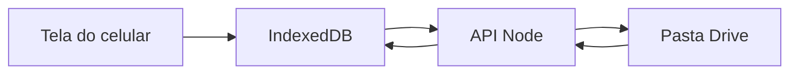

# Catálogo de produtos (celular + Google Drive)

Interface rápida no celular. Fonte da verdade no [Google Drive](https://drive.google.com/drive/folders/1Dq9o2-LJ_RKvSilpgEa_enXLus4QVylY). Credenciais iguais às do Fundo Bíblico ([church-inventory-orders](../church-inventory-orders)), descritas em [GOOGLE_DRIVE_SETUP.md](../church-inventory-orders/GOOGLE_DRIVE_SETUP.md).

A chave da service account **não pode ir no navegador**. Por isso o site deixa de ser só `index.html`: um servidor Node pequeno guarda o segredo e fala com o Drive.

## Por que um servidor

O Fundo Bíblico usa `googleapis` no servidor com:

- `GOOGLE_SERVICE_ACCOUNT_JSON` (ou `GOOGLE_APPLICATION_CREDENTIALS`)
- `GOOGLE_DRIVE_FOLDER_ID`

O catálogo reutiliza as **mesmas variáveis**, apontando para esta pasta:

`GOOGLE_DRIVE_FOLDER_ID=1Dq9o2-LJ_RKvSilpgEa_enXLus4QVylY`

Pré-requisito: essa pasta precisa estar compartilhada com `fondo-biblico-drive@projetoscci.iam.gserviceaccount.com` como **Editor** (igual ao Fundo Bíblico). Sem isso o upload falha.

`.env` local (nunca commitado), copiado do projeto do Fundo Bíblico — só muda o ID da pasta.

## Uso no celular (igual ao plano anterior)

- Uma coluna, toques ≥44px, `safe-area`, FAB embaixo à direita
- Foto com `capture="environment"` (câmera traseira / galeria)
- Modal de cadastro em tela cheia
- Quantidade +/− no card, sem abrir o formulário
- Busca no topo; lista pela validade mais próxima
- Badges: vencido / vence em 7 dias / ok
- Indicador discreto: **Salvo no Drive** / **A sincronizar…** / **Sem internet**

## Persistência (rápido + Drive)

O celular responde na hora; o Drive grava em seguida.



- **IndexedDB**: uso imediato (quantidade +/− sem esperar a rede)
- **Drive**: backup e uso em outro aparelho
- Ao abrir o app: baixa `catalogo.json` e as fotos; se estiver offline, usa o que já está no aparelho
- Ao salvar: atualiza o IndexedDB na hora e envia para a API (debounce ~1s na quantidade)

Cada produto:

```js
{ id, name, quantity, expiresAt, photoId, createdAt }
```

No Drive:

```
1Dq9o2-LJ_RKvSilpgEa_enXLus4QVylY/
  catalogo.json
  fotos/
    {id}.jpg
```

A API espelha o padrão de [`google-drive.server.ts`](../church-inventory-orders/src/lib/google-drive.server.ts) (`supportsAllDrives`, criar pasta se faltar, `googleapis`). Sem copiar o app React do Fundo Bíblico — só a autenticação e o upload.

## Exportação (além do Drive)

Menu compacto no cabeçalho:

- **JSON** — backup local com fotos
- **CSV** — Excel (nome, quantidade, validade)
- Importar JSON **acrescenta** produtos

## Arquivos neste repo (`catalogo`)

- [`public/index.html`](public/index.html), [`public/styles.css`](public/styles.css), [`public/app.js`](public/app.js) — UI mobile
- [`server.mjs`](server.mjs) — serve a pasta `public` e a API `/api/products`
- [`lib/google-drive.mjs`](lib/google-drive.mjs) — auth + upload/download (mesmo padrão do Fundo Bíblico)
- [`.env.example`](.env.example) — `GOOGLE_DRIVE_FOLDER_ID` e `GOOGLE_SERVICE_ACCOUNT_JSON`
- [`.gitignore`](.gitignore) — ignora `.env`
- [`package.json`](package.json) — `googleapis`, `dotenv`; script `npm start`
- [`README.md`](README.md) — compartilhar pasta, copiar `.env`, `npm start`, abrir no celular na rede local

API mínima:

- `GET /api/products` — lê `catalogo.json` + URLs/dados das fotos
- `PUT /api/products` — grava o catálogo inteiro (sync simples)
- `POST /api/products/:id/photo` — sobe a foto para `fotos/`

## Verificação

1. Confirmar que a pasta do Drive está compartilhada com a service account
2. Subir o servidor e cadastrar um produto com foto no viewport de celular
3. Conferir `catalogo.json` e a foto na [pasta do Drive](https://drive.google.com/drive/folders/1Dq9o2-LJ_RKvSilpgEa_enXLus4QVylY)
4. Recarregar o app e ver o produto de volta
5. Exportar JSON/CSV
